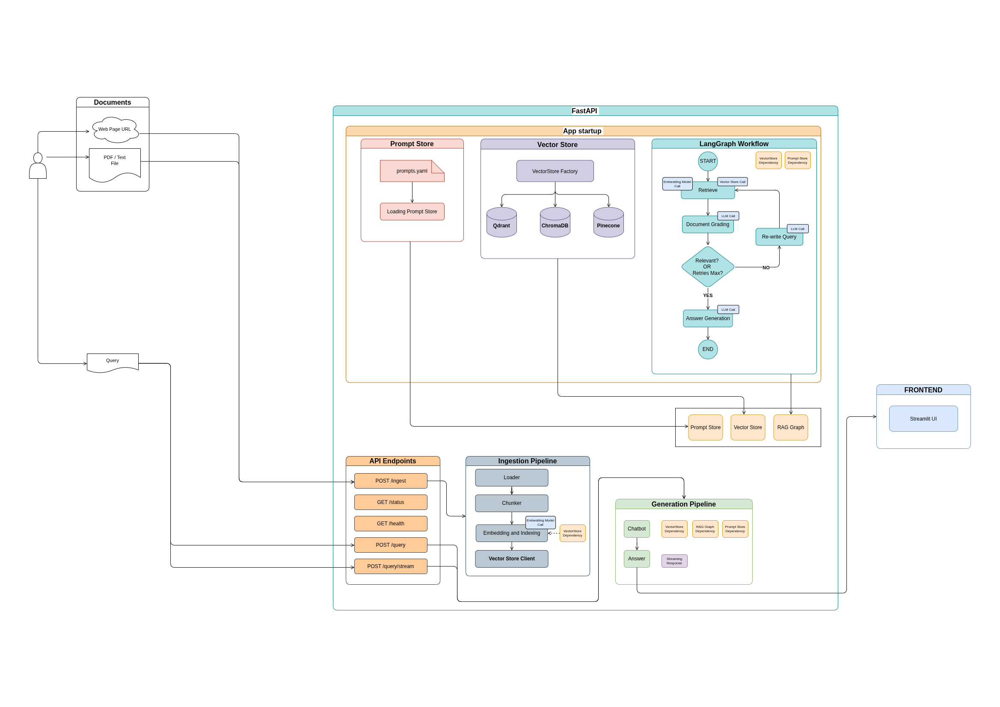
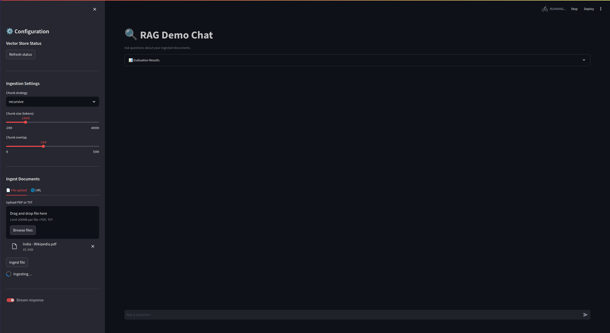
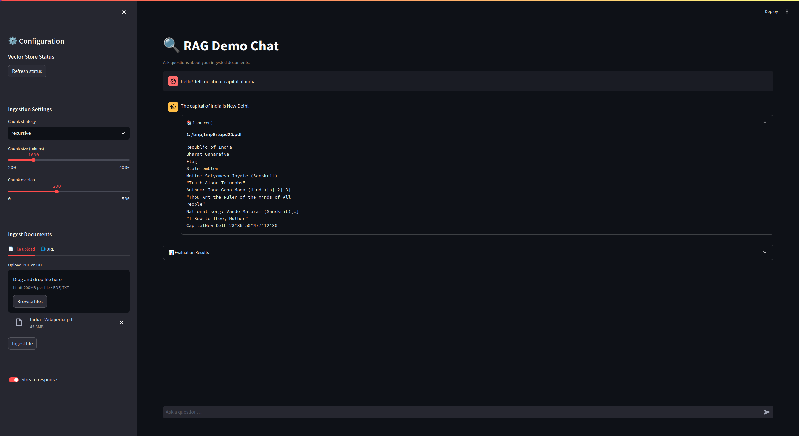
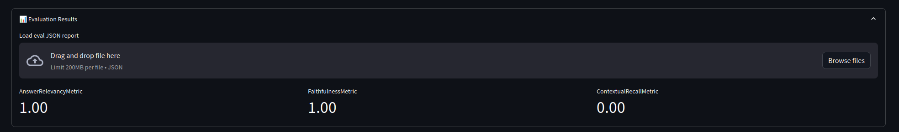

# Production RAG Starter
**Production RAG backend** - *FastAPI + LangGraph + pluggable vector store*.  
**Launching soon.**  
**Star to follow.**  

---
## Architecture


---
## Quickstart

```bash
# 1. Clone and configure
cp .env.example .env
# Edit .env — set OPENAI_API_KEY=sk-...

# 2. Start everything
docker compose up --build

# 3. Open the UI
open http://localhost:8501
```

---
## Screenshots
### Ingestion of PDFs

---
### Answer Generation and Chunk Retrieval

---
### Evaluation

